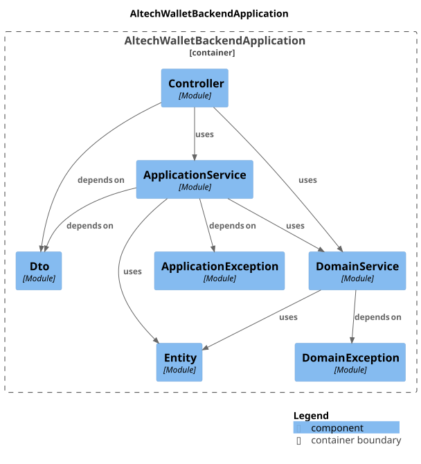

# Altech Wallet Backend
Time used: ~ two days of off-hours  
Take home assignment from Altech.
- partially an assignment
- partially for fun / an exercise for:
  - Spring Modulith
  - DDD
  - Clean architecture

## Deployment

### Prerequisites
Docker
### Build docker image
```shell
./mvnw package
```

### Deploy
```shell
docker compose up
```


## Design decisions

### Clean architecture


### Architecture philosophy (Ideal)
- Domain: Unrestricted wallet-to-wallet transactions
- Application: 
  - Currency type (USD) and 1-player-to-1-wallet restrictions
  - Mapping layer
- Infra: DB (Postgres / Redis) concerns
- Presentation: Endpoint (http / rpc?, etc.) handling 

### Architecture reality
- Merged domain / infra layer for JPA / Domain entities


## Concurrency & idempotency
- key-based transaction idempotency in application layer
- wallet jpa entity versioning for concurrent credit/debit

## Assumptions / limitations
- 1-1 Player-Wallet(USD) mapping
  - Minimize engineering time
- No simple credit / debit support in application layer
  - Must be transaction with clear to/from accounts
- 19 significant digit transactions
- Printing / destroying money requires dedicated Player / Wallet object
- Idempotency and getBalance Redis caching not implemented yet, will justify dedicated infrastructure layer
- Single application instance

## Supporting practices
- Docker Compose
- OpenApi
- AI Tooling notes
  - No agentic workflows
  - Chat-based pair programming (through web guis because I'm poor)
    - Human:AI effort ~50:50
  - AI involvement (Low to high:
    - Domain
    - Application
    - Presentation
    - (Infrastructure)
