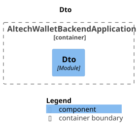
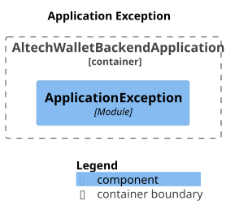
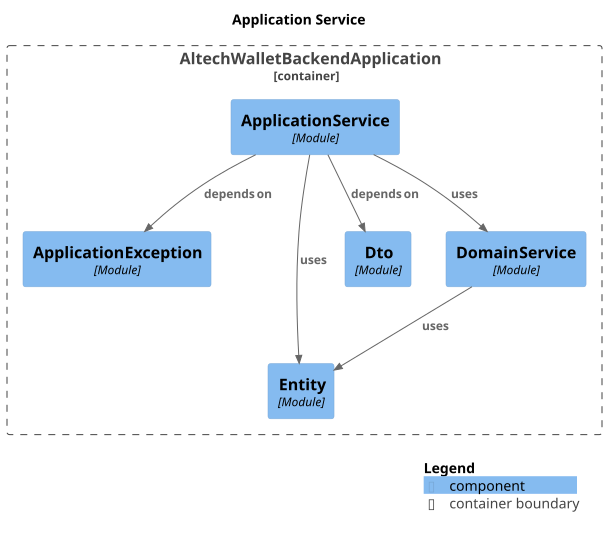
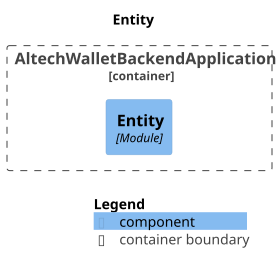
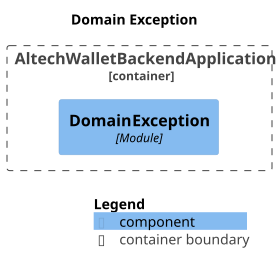
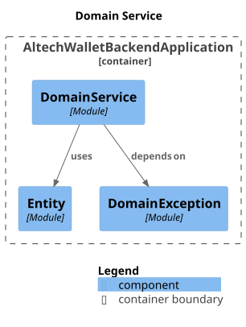
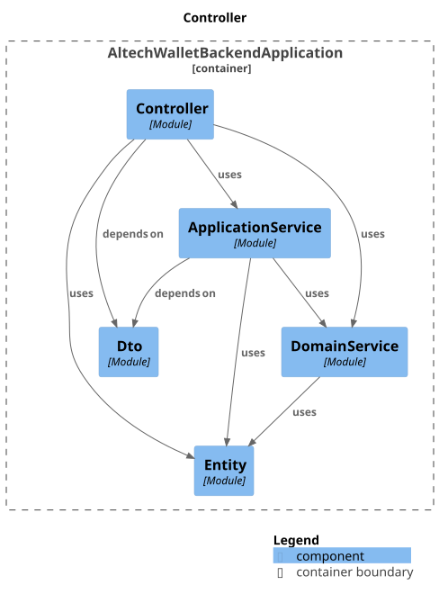

### components

### module-application.dto

### module-application.exception

### module-application.service

### module-domain.entity

### module-domain.exception

### module-domain.service

### module-presentation.controller

